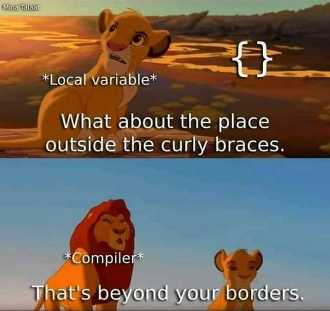

# 03 Java – Variablen

Variablen sind benannte Speicherbereiche im Hauptspeicher eines Computers. Sie dienen dazu, Daten zu speichern und
können dann zu einem späteren Zeitpunkt wieder ausgelesen oder überschrieben werden. Es wird zwischen 5 verschiedenen
Arten von Variablen unterschieden.

<list>
  <li>
    
<format color="%c1%">Lokale Variablen</format> existieren nur innerhalb von
    <format color="%LinkColor%"><a href="09-java-methods.md">Methoden</a></format> oder Anweisungsblöcken.

  </li>
  <li>
    
<format color="%c2%">Parametervariablen</format> existieren ebenfalls nur innerhalb von Methoden. Auch sie sind
    automatisch immer <format color="%c1%">lokale Variablen</format>, die in der Parameterliste deklariert werden und
    Werte beinhalten, die über einen
    <format color="%LinkColor%"><a href="09-java-methods.md#static-method-call">Methodenaufruf</a></format> an die
    Methoden übergeben wurden.

  </li>
  <li>
    
<format color="%c3%">Objektvariablen</format> (auch Instanzvariablen genannt) werden im Rahmen einer
    <format color="%LinkColor%"><a href="10-java-classes.md">Klasse</a></format> definiert und zusammen mit
    <format color="%LinkColor%"><a href="11-java-objects.md">Objekten</a></format> angelegt.

  </li>
  <li>
    
<format color="%c4%">Klassenvariablen</format> (auch statische Variablen genannt) werden ebenfalls innerhalb
    einer <format color="%LinkColor%"><a href="10-java-classes.md">Klasse</a></format> definiert, existieren jedoch
    unabhängig von <format color="%LinkColor%"><a href="11-java-objects.md">Objekten</a></format>.

  </li>
  <li>
    
<format color="%c5%">Konstanten</format> sind immer <format color="%c4%">Klassenvariablen</format>. Der Wert kann
    jedoch nicht überschrieben werden.

  </li>
</list>

<tip>
    
In den folgenden Kapiteln wird sich zunächst nur auf die Verwendung von
    <format color="%c1%">lokalen Variablen</format> beschränkt.

    
Mit <format color="%c2%">Parametervariablen</format> wird sich in
    <format color="%LinkColor%"><a href="09-java-methods.md">Kapitel 9 – Methoden</a></format> beschäftigt.

    
<format color="%c3%">Objektvariablen</format>, <format color="%c4%">Klassenvariablen</format> und
    <format color="%c5%">Konstanten</format> werden in
    <format color="%LinkColor%"><a href="10-java-classes.md">Kapitel 10 – Klassen</a></format> behandelt.

</tip>

## Variablendeklaration {id="variable-declaration"}

Eine Variable besteht, abhängig vom
<format color="%LinkColor%"><a href="02-java-data-types.md#primitive-data-types">primitiven</a></format> oder
<format color="%LinkColor%"><a href="02-java-data-types.md#reference-data-types-outlook">Referenzdatentyp</a></format>, aus
verschiedenen Bestandteilen.

<tabs group="variable-declaration">
  <tab id="variable-declaration-primitive" title="Primitive Datentypen" group-key="primitive">
    
1. Datentyp

    
2. Bezeichner der Variablen

    
3. Zuweisungsoperator <code>=</code>

    
4. Literal

    
5. Semikolon <code>;</code>

    <code-block>
      type identifier = literal;
    </code-block> 
    <code-block lang="java">
      int meaningOfLife = 42;
      boolean isRunning = false;
      char at = '@';
    </code-block>
    <table>
      <tr>
        <td>Bestandteil</td>
        <td>Beispiel</td>
      </tr>
      <tr>
        <td>type</td>
        <td><code>int</code>, <code>char</code>, <code>boolean</code></td>
      </tr>
      <tr>
        <td>identifier</td>
        <td><code>meaningOfLife</code>, <code>isRunning</code>, <code>at</code></td>
      </tr>
      <tr>
        <td>literal</td>
        <td><code>42</code>, <code>false</code>, <code>@</code></td>
      </tr>
    </table>
  </tab>
  <tab id="variable-declaration-reference" title="Referenzdatentypen (Objekte)" group-key="reference">
    
1. Datentyp

    
2. Bezeichner der Variablen

    
3. Zuweisungsoperator <code>=</code>

    
4. Schlüsselwort <code>new</code>

    
5. Datentyp

    
6. Runde Klammern <code>()</code>

    
7. Semikolon <code>;</code>
 
    <code-block>
      Type identifier = new Type();
    </code-block> 
    <code-block lang="java">
      String name = "Kesares";
      Movie movie = new Movie();
      Dog dog = new Dog();
    </code-block>
    <table>
      <tr>
        <td>Bestandteil</td>
        <td>Beispiel</td>
      </tr>
      <tr>
        <td>type</td>
        <td><code>String</code>, <code>Movie</code>, <code>Dog</code></td>
      </tr>
      <tr>
        <td>identifier</td>
        <td><code>name</code>, <code>movie</code>, <code>dog</code></td>
      </tr>
      <tr>
        <td>object</td>
        <td><code>"Kesares"</code>, <code>Movie()</code>, <code>Dog()</code></td>
      </tr>
    </table>
  </tab>
</tabs>

<note>
    
<format color="%NoteLinkColor%"><a href="02-java-data-types.md#primitive-data-types">Primitive Datentypen</a>
    </format> werden immer klein und
    <format color="%NoteLinkColor%"><a href="02-java-data-types.md#reference-data-types-outlook">Referenzdatentypen</a></format>
    immer großgeschrieben.

</note>

## Deklaration vs. Initialisierung {id="declaration-vs-initialisation"}

Durch eine Deklaration wird eine Variable erstellt und Speicherplatz für sie reserviert. Dabei wird der Variablen
noch kein Wert zugewiesen. Dies erfolgt erst durch eine Initialisierung.

Die Deklaration und Initialisierung einer Variablen kann entweder in einer oder in zwei separaten Zeilen erfolgen.

<code-block lang="java">
    int x;       // Declaration
    x = 15;      // Initialization
    
    int y = 10;  // Declaration & initialization
    y = 42;      // Assignment, value is overwritten
</code-block>

Auch mehrere Variablen in einer Zeile sind möglich.

<code-block lang="java">
    int v1, v2, v3;                // Declaration
    int v4 = 10, v5 = 11, v6 = 12; // Declaration & initialization
</code-block>

<note>
    
Ein guter Programmierstil sieht vor, dass jede Variable in einer eigenen Zeile deklariert wird, um die
    Übersichtlichkeit des Codes zu gewährleisten.

</note>

## Typumwandlung {id="type-casting"}

Als Typumwandlung (eng. type casting) wird die Umwandlung eines
<format color="%LinkColor%"><a href="02-java-data-types.md">Datentyps</a></format> in einen anderen bezeichnet. In Java
wird zwischen 2 Arten unterschieden.

<list>
  <li>
    
<format color="%c1%">Implizite Typumwandlung</format>

  </li>
  <li>
    
<format color="%c2%">Explizite Typumwandlung</format>

  </li>
</list>

### <format color="%c1%">Implizite Typumwandlung</format> {id="implicit-type-casting"}

Die implizite Typumwandlung erfolgt automatisch bei der Zuweisung von Werten. Dabei wird ein Datentyp mit niedrigerer
Präzision in einen Datentyp mit höherer Präzision umgewandelt, zum Beispiel vom Typ <code>int</code> zum Typ
<code>long</code>.

<code-block lang="java">
    int i = 42;
    long l = i;
</code-block>

### <format color="%c2%">Explizite Typumwandlung</format> {id="explicit-type-casting"}

Die explizite Typumwandlung erfolgt mithilfe des Cast-Operators, der eine gezielte Konvertierung im
Quellcode ermöglicht. Dabei wird ein Datentyp mit höherer Präzision in einen Datentyp mit niedrigerer Präzision
umgewandelt, zum Beispiel von <code>short</code> in <code>byte</code> oder von <code>float</code> in <code>int</code>.
Der Cast-Operator erfordert die explizite Angabe des Zieltyps, in den umgewandelt werden soll.

<code-block lang="java">
    short s = 128;
    byte b = (byte) s;
    
    float f = 3.14F;
    int i = (int) f;
</code-block>

Wenn in einer Zeile, in der ein Cast durchgeführt wird, auch eine Berechnung stattfinden soll, muss die Berechnung in
runden Klammern gesetzt werden. Dadurch wird sichergestellt, dass die Berechnung vor der Typumwandlung ausgeführt wird.

<code-block lang="java">
    double a = 10.5;
    short b = 20;
    
    short ab = (short) (a + b);
</code-block>

<warning title="Achtung: Datenverlust!">
    
Da zum Beispiel ein <code>byte</code> weniger Speicherplatz bietet als ein <code>short</code> und ein
    <code>short</code> im Vergleich zu <code>double</code> nur ganze Zahlen verarbeitet, kann es zu fehlerhaften
    Berechnungen kommen – mit anderen Worten: <format color="%WarningLinkColor%">Datenverlust</format>!

</warning>

<tip>
    
Auch die Konvertierung zwischen Referenztypen ist möglich. Dazu mehr in
    <format color="%LinkColor%"><a href="14-java-oop.md#the-keyword-instanceof">
    Kapitel 14 – OOP: Das Keyword <code>instanceof</code></a></format>.

</tip>

## Primitive Datentypen und Wrapper-Klassen {id="primitive-data-types-and-wrapper-classes"}

Wie in der Tabelle zu Beginn des letzten Kapitels aufgezeigt, besitzt jeder
<format color="%LinkColor%"><a href="02-java-data-types.md#primitive-data-types">primitive Typ</a></format> eine
entsprechende <tooltip term="Wrapper-Class"><format color="%GlossaryLinkColor%">Wrapper-Klasse</format></tooltip>. In
Java wird zwischen den primitiven Datentypen und den
<format color="%LinkColor%"><a href="11-java-objects.md">Referenztypen</a></format> (Objekte) unterschieden.

Wrapper-Klassen wie <code>Integer</code>, <code>Double</code> oder <code>Character</code> umhüllen oder verpacken
primitive Datentypen zu Objekten, um diese beispielsweise in
<format color="%LinkColor%"><a href="19-java-collections.md#lists">Listen</a></format> speichern zu können. Listen
verwenden <format color="%LinkColor%"><a href="17-java-generics.md">Generics</a></format> und diese können wiederum nur
mit <format color="%LinkColor%"><a href="11-java-objects.md">Referenztypen</a></format> umgehen. Wrapper-Klassen selbst
bieten noch einige <format color="%LinkColor%"><a href="09-java-methods.md">Methoden</a></format> für Konvertierungen,
Vergleiche und andere Operationen.

### Autoboxing {id="autoboxing"}

Wird ein
<format color="%LinkColor%"><a href="02-java-data-types.md#primitive-data-types">primitiver Datentyp</a></format> in
seinen entsprechenden Wrapper-Typ umgewandelt, wird dies als Autoboxing bezeichnet.

<code-block lang="java">
    int primitiveInt = 42;
    Integer wrapperInt = primitiveInt; // Autoboxing
</code-block>

### Unboxing {id="unboxing"}

Das Gegenteil von Autoboxing ist das Unboxing. Hierbei wird automatisch ein Wrapper-Typ in den entsprechenden
<format color="%LinkColor%"><a href="02-java-data-types.md#primitive-data-types">primitiven Datentyp</a></format>
 umgewandelt.

<code-block lang="java">
    Integer wrapperInt = 42;
    int primitiveInt = wrapperInt; // Unboxing
</code-block>

<note>
    
Sowohl <format color="%NoteLinkColor%"><a href="#autoboxing">Autoboxing</a></format> als auch
    <format color="%NoteLinkColor%"><a href="#autoboxing">Unboxing</a></format> können zu einer geringeren Performance
    führen, da im Hintergrund zusätzliche Konvertierungen stattfinden und sollten bedacht werden, um Rechenkosten zu
    sparen.

</note>

## Reservierter Typname – `var` {id="reserved-type-name-var"}

Seit Java 10 ist es möglich, die explizite Typangabe durch ein <code>var</code> zu ersetzen. <code>var</code> dient
im Rahmen der <format color="%Highlight%">Type Inference</format> als Platzhalter für einen Datentyp.

<compare>
    <code-block lang="java">
        int meaningOfLife = 42;
        boolean isRunning = false;
        char at = '@';
    </code-block>
    <code-block lang="java">
        var meaningOfLife = 42;
        var isRunning = false;
        var at = '@';
    </code-block>
</compare>

<warning>
    
Wird eine Variable mit <code>var</code> deklariert, aber in derselben Zeile
    <format color="%WarningHighlight%">nicht</format> initialisiert, führt dies zu einem
    <format color="%WarningHighlight%">Compilerfehler</format>!

</warning>

Sowohl die Deklaration als auch die Initialisierung müssen in derselben Zeile stehen. Der
<tooltip term="Compiler"><format color="%GlossaryLinkColor%">Compiler</format></tooltip> ermittelt den Typ der Variablen
selbst. Zudem kann <code>var</code> nur für <format color="%c1%">lokale Variablen</format> eingesetzt werden.

<tip>
    
<code>var</code> wird häufig als Keyword verwechselt, ist aber ein
    <format color="%Highlight%">Reserved Type Name</format> und kann daher auch als
    <format color="%LinkColor%"><a href="01-java-token.md#identifier">Bezeichner</a></format> verwendet werden.

</tip>

## Lebensdauer und Sichtbarkeit {id="lifespan-and-visibility"}

Die Lebensdauer beschreibt die Zeitspanne von der „Geburt“ bis zum „Tod“ einer Variablen. Die Lebensdauer einer
<format color="Coral">lokalen Variablen</format> beginnt mit der Variablendeklaration. Wurde die Variable innerhalb
einer Block-Anweisung deklariert, endet ihre Lebenszeit mit Verlassen des Blocks. Wurde die Variable in einer
<format color="%LinkColor%"><a href="09-java-methods.md">Methode</a></format> deklariert, dann wird ihre Existenz mit
Ende des <format color="%LinkColor%"><a href="09-java-methods.md#static-method-call">Methodenaufrufs</a></format>
 ausgelöscht. Solange eine Variable existiert, ist sie auch für andere Programmteile sichtbar.

Folgendes Beispiel zur Veranschaulichung. Zu beachten sind die geschweiften Klammern <code>{}</code>:

<code-block lang="java">
    { // Start of the 1st block
        int i = 10;
        i++;
        { // Start of the 2nd block
            int j = 10;
            i++;
            j++;
            { // Start of the 3rd block
                int k = 10;
                i++;
                j++;
                k++;
            } // End of the 3rd block
            i++;
            j++;
            k++; // Out of scope
        } // End of the 2nd block
        i++;
        j++; // Out of scope
        k++; // Out of scope
    } // End of the 1st block
</code-block>

<list>
  <li>
    
Die Variable <code>i</code> ist in allen Anweisungsblöcken sichtbar.

  </li>
  <li>
    
Die Variable <code>j</code> ist nur im 2. und 3. Block sichtbar.

  </li>
  <li>
    
Die Variable <code>k</code> ist nur im 3. Block sichtbar.

  </li>
</list>

Bei den letzten beiden Zuweisungen kann nicht auf die Variable <code>j</code> und <code>k</code> zugegriffen werden,
da sie nur innerhalb des 2. bzw. 3. Blocks existieren. Dasselbe gilt für den Variablenzugriff <code>k</code> im 2.
Anweisungsblock.

{width="400"}

## Typisierung {id="typing"}
### Starke vs. schwache Typisierung {id="strong-vs-weak-typing"}

<note>
    
Java ist eine stark typisierte Sprache.

</note>

<format color="%Highlight%">Stark typisiert</format> bedeutet, dass eine Sprache
<format color="%Highlight%">sehr strikt bei der Durchsetzung von Datentypen</format> vorgeht. Wird eine Variable
angelegt, sorgt Java auch dafür, dass der Programmierer genau angeben muss, welchen Datentyp diese Variable haben soll.
Zudem behält Java bzw. der <tooltip term="Compiler"><format color="%GlossaryLinkColor%">Compiler</format></tooltip> ein
Auge darauf, dass sich der Typ dieser Variablen nicht verändert. Einmal eine Variable erstellt, behält sie den Typ bis
zum Ende der Lebensdauer.

Eine Ausnahme bildet hier die in Java 10 hinzugefügte Möglichkeit, Variablen mit <code>var</code> anzugeben. Doch
auch hier bleibt während der gesamten Lebensdauer der Typ gleich.

<format color="%Highlight%">Schwach typisiert</format> bedeutet, dass eine Sprache "nachsichtiger" ist, wenn es um
Typisierung geht. Hier wird eine automatische Typenumwandlung durchgeführt, um möglichst einfach Resultate generieren
zu können.

<tip>
    
Stark typisierte Sprachen sind z. B. Java, C++, Python, Smalltalk, Haskell und Pascal.

    
Schwach typisierte Sprachen sind z. B. C, JavaScript, Lua, PHP und Perl.

</tip>

### Statische vs. dynamische Typisierung {id="static-vs-dynamic-typing"}

<note>
    
Java ist eine statisch typisierte Sprache.

</note>

<format color="%Highlight%">Statisch typisiert</format> bedeutet, dass eine Sprache
<format color="%Highlight%">zur Kompilierungszeit</format> sicherstellt, dass alle Typregeln stets befolgt werden.

Bei der <format color="%Highlight%">dynamischen Typisierung</format> findet diese Überprüfung nicht zur
Kompilierungszeit, sondern später <format color="%Highlight%">zur Laufzeit</format> statt, wenn das Programm bereits
läuft. Dies macht das Schreiben von Code einfacher, da der Entwickler sich nicht darum kümmern muss, welche Datentypen
die Variablen haben. Allerdings erschwert dies auch das spätere Debugging, sollte es zu einem Runtime Error kommen,
wenn zwei Datentypen inkompatibel sind.

<tip>
    
Statisch typisierte Sprachen sind z. B. Java, C, C++, Haskell und Pascal.

    
Dynamisch typisierte Sprachen sind z. B. Python, Smalltalk, Lua, PHP, JavaScript und Perl.

</tip>

## Coding Conventions {id="coding-conventions"}

<list>
  <li>
    
Variablen sollten nach der
    <tooltip term="CamelCase-Notation"><format color="%GlossaryLinkColor%">CamelCase-Notation</format></tooltip>
    geschrieben werden.

  </li>
  <li>
    
Bei einer <format color="%LinkColor%"><a href="07-java-loops.md">Schleifenvariable</a></format> ist auch ein
    einziger Buchstabe ausreichend.

  </li>
  <li>
    
Variablen vom Typ <code>boolean</code>, sollten nach Möglichkeit mit <code>is</code> beginnen. Alternativ kann
    auch auf <code>has</code> zurückgegriffen werden.

  </li>
  <li>
    
<format color="%c5%"><a href="10-java-classes.md#constants">Konstanten</a></format> sollten nach der
    <tooltip term="Constants-Notation"><format color="%GlossaryLinkColor%">SCREAMING_SNAKE_CASE-Notation</format>
    </tooltip> geschrieben werden.

  </li>
</list>
