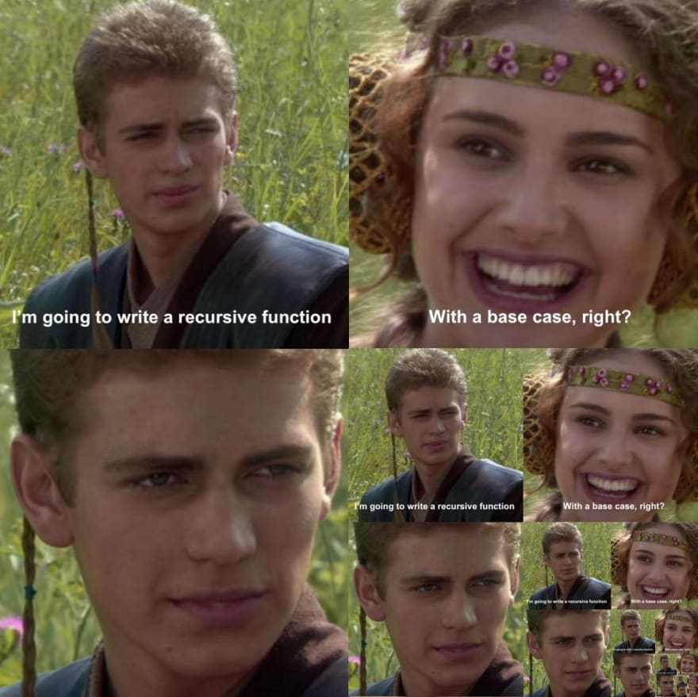

# 09 Java – Methoden

Methoden bestimmen das Verhalten von <format color="%LinkColor%"><a href="11-java-objects.md">Objekten</a></format>
 und des Programms. Sie werden innerhalb einer <format color="%LinkColor%"><a href="10-java-classes.md">Klasse</a>
</format> angelegt. Wird derselbe Programmcode an mehreren Stellen verwendet, kann dieser in eine Methode ausgelagert
werden und stattdessen die Methode aufgerufen werden.

## Klassen- & Objektmethoden {id="class-and-object-methods"}

Grundsätzlich kann zwischen zwei Methodenarten unterschieden werden.

<list>
  <li>
<format color="%c1%">Objektmethoden</format> (auch Instanzmethoden)
</li>
  <li>
<format color="%c2%">Klassenmethoden</format> (auch statische Methoden)
</li>
</list>

<format color="%LinkColor%"><a href="10-java-classes.md#object-methods">Objektmethoden</a></format> können nur über
konkret instanziierte <format color="%LinkColor%"><a href="11-java-objects.md">Objekte</a></format> aufgerufen werden.
<format color="%LinkColor%"><a href="10-java-classes.md#class-methods">Klassenmethoden</a></format> brauchen kein
instanziiertes Objekt. Sie können über die Klasse direkt aufgerufen werden. In diesem Kapitel fokussieren wir uns auf
die Klassenmethoden, da wir diese aus der <format color="%LinkColor%"><a href="#main-method">main-Methode</a></format>
 aufrufen können, ohne dass ein Objekt instanziiert werden muss.

## Methodenstruktur {id="method-structure"}

Allgemein wird eine Methode in zwei Bereiche unterteilt. Zum einen den <format color="%Highlight%">Kopf</format> -
dieser beinhaltet alles vom
<format color="%TipLinkColor%"><a href="12-java-modifier-access-rights.md#access-modifier">Access Modifier</a></format>
 bis zur geschlossenen runden Klammer. Zum anderen den <format color="%TipLinkColor%">Rumpf</format> - dieser ist der
eigentliche Code-Block mit den geschweiften Klammern <code>{}</code>.

<code-block>
    // Class method
    access-modifier static return-type methodName(parameter) {
        // Code...
    }
</code-block>

<code-block>
    // Object method
    access-modifier return-type methodName(parameter) {
        // Code...
    }
</code-block>

<table>
    <tr>
        <td>Teil des Methodenkopfes</td>
        <td>Beschreibung</td>
    </tr>
    <tr>
        <td>access-modifier</td>
        <td><code>public</code>, <code>private</code>, <code>protected</code> oder implizit <code>package-private</code>
        .</td>
    </tr>
    <tr>
        <td><code>static</code></td>
        <td><a href="01-java-token.md">Keyword</a> für den statischen Aufruf der Methode über den Klassennamen.</td>
    </tr>
    <tr>
        <td>type</td>
        <td>Der Rückgabetyp der angibt, von welchem <format color="%LinkColor%"><a href="02-java-data-types.md">Datentyp
        </a></format> das Ergebnis der Methode ist, sofern etwas zurückgegeben wird.</td>
    </tr>
    <tr>
        <td>methodName</td>
        <td>Ein <format color="%LinkColor%"><a href="01-java-token.md#identifier">Identifier</a></format> für den Namen
        der Methode.</td>
    </tr>
    <tr>
        <td>parameter</td>
        <td>Ein oder mehrere Werte, die optional an diese Methode übergeben werden können.</td>
    </tr>
</table>

<note title="package-private">
    
Der <format color="%NoteLinkColor%"><a href="12-java-modifier-access-rights.md#access-modifier">Access Modifier
    </a></format> kann weggelassen werden. Die Methode besitzt dann implizit den Modifier <code>package-private</code>.
    Dieser Modifier kann vom Entwickler nicht selbst gesetzt werden.

</note>

### Methodensignatur {id="method-signature"}

Die Signatur einer Methode besteht aus ihrem Namen und ihrer Parameterliste. Der Rückgabetyp und die
<format color="%LinkColor%"><a href="12-java-modifier-access-rights.md#access-modifier">Zugriffsmodifizierer</a>
</format> sind nicht Teil der Signatur. Die Signatur ist wichtig, um Methoden innerhalb einer
<format color="%LinkColor%"><a href="10-java-classes.md">Klasse</a></format> zu unterscheiden, insbesondere bei der
<format color="%LinkColor%"><a href="#method-overloading">Methodenüberladung</a></format> (eng. method overloading), wo
mehrere Methoden denselben Namen, aber unterschiedliche Parameterlisten haben können.

## `main`-Methode {id="main-method"}

Eine Methode sollte bereits bekannt sein – die <code>main()</code>-Methode.

<code-block lang="java">
    public static void main(String[] args) {
        // Code...
    }
</code-block>

Diese ist die Wichtigste, da sie als zentraler Einstiegspunkt in unsere eigenen Programme fungiert und vorhanden sein
muss. Die Methode erwartet ein <code>String[]</code> als Parameter, welches optionale Argumente beinhaltet, die beim
Programmstart mit übergeben werden können und innerhalb des Programms verarbeitet werden.

<code>public</code> und <code>static</code> sind Keywords und werden im
<format color="%LinkColor%"><a href="12-java-modifier-access-rights.md">Kapitel 12 – Modifizierer & Zugriffsrechte</a>
</format> genauer erklärt.

An der <code>main()</code>-Methode darf nichts verändert werden, außer den
<format color="%LinkColor%"><a href="01-java-token.md#identifier">Identifier</a></format> des Parameters anders zu
nennen oder das <format color="%LinkColor%"><a href="08-java-arrays.md">Array</a></format> in ein
<format color="%LinkColor%"><a href="#varargs">Vararg</a></format> zu ändern.

<code-block lang="java">
    public static void start(String[] args) {
        // Code...
    }
</code-block>

<warning title="Fehlende main-Methode">
    <code-block>
        Fehler: Hauptmethode in Klasse kesares.techarchive.Main nicht gefunden.
        Definieren Sie die Hauptmethode als: public static void main(String[] args):
        oder eine JavaFX-Anwendung muss javafx.application.Application erweitern
    </code-block>
</warning>

<tip>
    
Je nachdem welche <tooltip term="IDE"><format color="%GlossaryLinkColor%">IDE</format></tooltip> verwendet wird
    und welche Systemsprache eingestellt ist, kann die Fehlermeldung etwas anders aussehen.

</tip>

## Rückgabetyp {id="return-type"}

Eine Methode hat die Möglichkeit ein Ergebnis an den Methodenaufrufer (eng. method caller) zurückzugeben – hier
findet auch das Keyword <code>return</code> Anwendung. Der Rückgabewert, welcher zurückgegeben wird, hängt vom
Rückgabetyp ab.

<note title="Method Caller">
    
In Java wird eine Methode von einer anderen Methode aufgerufen. Die aufrufende Methode wird als
    <format color="%NoteHighlight%">Method Caller</format> (Methodenaufrufer) bezeichnet. Dieser Aufrufer kann das
    Ergebnis, das von der aufgerufenen Methode zurückgegeben wird, empfangen und weiterverwenden.

</note>

Methoden können sowohl
<format color="%LinkColor%"><a href="02-java-data-types.md#primitive-data-types">primitive Datentypen</a></format> als
auch <format color="%LinkColor%"><a href="11-java-objects.md">Objekte</a></format> zurückgeben. Für die primitiven
Datentypen werden deren Keywords angegeben, für Referenztypen deren Klassennamen. Falls die Methode nichts zurückgibt,
steht im Methodenkopf das Keyword <code>void</code>.

Zur direkten Weitergabe kann der Rückgabewert z. B. an eine andere Methode oder eine andere Berechnung übermittelt
werden. Alternativ kann dieser auch zwischengespeichert werden, anstatt den Wert erneut zu berechnen.

<code-block lang="java">
    public static void main(String[] args) {
        System.out.println(isEven(3));
    
        boolean b = isEven(6);
        System.out.println(b);
    }
    
    public static boolean isEven(int n) {
        if (n % 2 == 0) {
            return true;
        } else {
            return false;
        }
    }
</code-block>

Durch die <code>return</code>-Anweisung ist es möglich eine Methode auch früher zu verlassen. Im folgenden Beispiel
erhält die Methode eine Trennzeichenfolge und einen Text. Der Text soll überall dort gesplittet werden, an dessen Stelle
dieses Zeichen bzw. diese Zeichenfolge – also der <code>delimiter</code> – vorkommt und gibt die getrennten Wörter in
einem <code>String[]</code> zurück.

Die Methode kann jedoch früher verlassen werden und gibt ein leeres
<format color="%LinkColor%"><a href="08-java-arrays.md">Array</a></format> zurück, wenn der Text <code>null</code>, also
nicht vorhanden, oder die Textlänge kleiner oder gleich <code>0</code> ist.

<code-block lang="java">
    public static String[] splitTextBy(String delimiter, String text) {
        if (text == null || text.length == 0) return new String[0];
        String[] words = text.split(delimeter);
        return words;
    }
</code-block>

Folgende Methode bekommt einen <code>String</code> mit einem Namen übergeben. Die Methode gibt jedoch nichts zurück,
sondern gibt stattdessen den Namen mit einem Begrüßungstext auf der Konsole aus.

<code-block lang="java">
    public static void printWelcomeMessage(String name) {
        System.out.println("Hello " + name + "!");
    }
</code-block>

Folgende Methode bekommt eine Zahl übergeben und überprüft, ob diese Zahl gerade ist. Wenn ja, wird <code>true</code>
 zurückgegeben, ansonsten <code>false</code>.

<code-block lang="java">
    public static boolean isEven(int n) {
        if (n % 2 == 0) {
            return true;
        } else {
            return false;
        }
    }
</code-block>

Die Methode <code>isEven()</code> kann sogar noch vereinfacht werden.

<compare>
    <code-block lang="java">
        public static boolean isEven(int n) {
            if (n % 2 == 0) {
                return true;
            } else {
                return false;
            }
        }
    </code-block>
    <code-block lang="java">
        public static boolean isEven(int n) {
            if (n % 2 == 0) {
                return true;
            }
            return false;
        }
    </code-block>
</compare>

<tabs>
    <tab title="Frage">
        
Kann die Methode <code>isEven()</code> noch weiter vereinfacht werden?

    </tab>
    <tab title="Lösung">
        <code-block lang="java">
            public static boolean isEven(int n) {
                return n % 2 == 0;
            }
        </code-block>
    </tab>
</tabs>

## Statischer Methodenaufruf {id="static-method-call"}

<code-block lang="java">
    ClassName.methodName(parameter);
</code-block>

Um die beiden Methoden aus dem vorherigen Abschnitt aufzurufen, muss Folgendes geschrieben werden:

<code-block lang="java">
    Main.isEven(4);
    
    printWelcomeMessage("Kesares");
</code-block>

Beide Methoden befinden sich in derselben Klasse wie die <code>main()</code>-Methode, aus der wir die beiden Methoden
aufrufen. Daher kann auf den vorangestellten Klassennamen <code>Main</code> verzichtet werden.

<tip>
    
Ein Methodenaufruf über ein <format color="%LinkColor%"><a href="11-java-objects.md">Objekt</a></format> muss
    über den Variablennamen oder das Objekt selbst geschehen.

    <code-block lang="java">
        String name = "Kesares";
        int length = name.length();
        length = "Kesares".length();
    </code-block>
</tip>

## Methodenüberladung {id="method-overloading"}

Es ist möglich, mehr als eine Methode mit demselben Methodennamen zu schreiben. Jedoch müssen sich die Methoden
entweder in der Anzahl der übergebenen Parameter oder – bei gleicher Anzahl – im Parametertyp unterscheiden.

<code-block lang="java">
    public void print(int n) {
        System.out.println(n);
    }
    
    public void print(double n) {
        System.out.println(n);
    }
    
    public void print(int n1, int n2) {
        System.out.println(n1 + n2);
    }
</code-block>

## Variable Parameteranzahl {id="varargs"}

Seit Java 5 ist es möglich eine beliebige Anzahl von Parametern vom gleichen Typ an eine Methode zu übergeben – auch
Vararg genannt. Intern erzeugt Java daraus ein <format color="%LinkColor%"><a href="08-java-arrays.md">Array</a>
</format>, das für die Weiterverarbeitung verwendet werden kann.

<code-block lang="java">
    public static void method1(int... numbers) {
        // Code...
    }
    
    public static void method2(String text, boolean b, int... numbers) {
        // Code...
    }
</code-block>

<code-block lang="java">
    public static void main(String[] args) {
        method1(1, 2, 3, 4, 5);
        method2("Hallo Kesares!", true, 1, 2, 3, 4, 5);
    }
</code-block>

<note title="Letzter Parameter als Vararg">
    
Nur der <format color="%NoteHighlight%">letzte</format> Methodenparameter darf ein Vararg sein. Der
    <tooltip term="Compiler"><format color="%GlossaryLinkColor%">Compiler</format></tooltip> kann die Parameter
    ansonsten nicht eindeutig übergeben.

</note>

## Finale Methoden {id="final-methods"}

Finale Methoden werden mit dem Keyword <code>final</code> deklariert. Sie können nicht von Kindklassen überschrieben
werden. Das Überschreiben von Methoden wird auch als Polymorphie oder
<format color="%LinkColor%"><a href="14-java-oop.md#polymorphism">Polymorphismus</a></format> bezeichnet und findet nur
bei der Vererbung Anwendung. Mehr zum Keyword <code>final</code> in
<format color="%LinkColor%"><a href="12-java-modifier-access-rights.md">Kapitel 12 – Modifizierer und Zugriffsrechte</a>
</format>.

<code-block lang="java">
    public final void print() {
        // Code...
    }
</code-block>

## Rekursion {id="recursion"}

Eine rekursive Methode ruft sich selbst immer wieder auf, bis ein bestimmter Zustand erreicht ist – vergleichbar mit
einer <format color="%LinkColor%"><a href="07-java-loops.md">Schleife</a></format>.

<code-block lang="java">
    public static void foo() {
        foo();
    }
</code-block>

<warning title="StackOverflowError">
    
Bei diesem Beispiel gibt es <format color="%WarningHighlight%">keine</format> Abbruchbedingung. D. h. diese
    Methode wird nie aufhören sich selbst aufzurufen, was in einem <code>StackOverflowError</code> resultiert!

</warning>

Folgende rekursive Methode berechnet die Quersumme einer übergebenen Zahl <code>n</code> und gibt diesen Wert zurück.

<code-block lang="java">
    public static int calculateChecksum(int n) {
        if (n &lt;= 0) return 0;
        return n % 10 + calculateChecksum(n / 10);
    }
</code-block>

<note>
    
Rekursion ist zwar eine feine Sache, in der Praxis wird diese jedoch oft vermieden und auf iterative Lösungen
    gesetzt, wenn es darum geht, robuste Software zu schreiben.

</note>

## Die `Math`-Klasse {id="the-math-class"}

Java bringt von Haus aus eine <format color="%LinkColor%"><a href="10-java-classes.md">Klasse</a></format> mit, die
ausschließlich <format color="%LinkColor%"><a href="10-java-classes.md#class-methods">statische Methoden</a></format>
 für verschiedene Berechnungen besitzt. Die <code>Math</code>-Klasse enthält Methoden für beispielsweise das Runden von
Kommazahlen, das Finden des Max- oder Min-Wertes, Wurzelberechnung, Zufallszahlen, Berechnung von Cosinus, Sinus und
sehr viel mehr.

<code-block lang="java">
    @IntrinsicCandidate
    public static int abs(int a) {
        return (a &lt; 0) ? -a : a;
    }
</code-block>

<code-block lang="java">
    @IntrinsicCandidate
    public static long round(double a) {
        long longBits = Double.doubleToRawLongBits(a);
        long biasedExp = (longBits & DoubleConsts.EXP_BIT_MASK)
                &gt;&gt; (DoubleConsts.SIGNIFICAND_WIDTH - 1);
        long shift = (DoubleConsts.SIGNIFICAND_WIDTH - 2
                + DoubleConsts.EXP_BIAS) - biasedExp;
        if ((shift & -64) == 0) {
            long r = ((longBits & DoubleConsts.SIGNIF_BIT_MASK)
                    | (DoubleConsts.SIGNIF_BIT_MASK + 1));
            if (longBits &lt; 0) {
                r = -r;
            }
            return ((r &gt;&gt; shift) + 1) &gt;&gt; 1;
        } else {
            return (long) a;
        }
    }
</code-block>

<code-block lang="java">
    @IntrinsicCandidate
    public static double pow(double a, double b) {
        return StrictMath.pow(a, b);
    }
</code-block>

<tip>
    
Die <format color="%LinkColor%"><a href="10-java-classes.md">Klasse</a></format> ist Teil des
    <code>java.lang</code>-Package und muss daher nicht selbst
    <format color="%LinkColor%"><a href="16-java-packages-and-imports.md">importiert</a></format> werden.

</tip>

## Call by Value vs. Call by Reference {id="call-by-value-or-reference"}

Wenn eine Methode mit <format color="%Highlight%">Call-by-Value</format> aufgerufen wird, wird der Wert an diese
Methode übergeben. Innerhalb der Methode wird eine Kopie des Werts erstellt und verwendet. Änderungen, die innerhalb der
Methode am Parameter vorgenommen werden, wirken sich nicht auf die ursprüngliche
<format color="%LinkColor%"><a href="03-java-variables.md">Variable</a></format> außerhalb der Methode aus. Dies ist der
Standard für
<format color="%LinkColor%"><a href="02-java-data-types.md#primitive-data-types">primitive Datentypen</a></format> in
vielen Programmiersprachen, einschließlich Java.

Beim <format color="%Highlight%">Call-by-Reference</format> wird eine Referenz (ein Zeiger) auf die ursprüngliche
<format color="%LinkColor%"><a href="03-java-variables.md">Variable</a></format> an die Funktion übergeben. Das
bedeutet, dass die Funktion direkt auf die ursprüngliche Variable zugreift. Änderungen, die innerhalb der Funktion am
Parameter vorgenommen werden, wirken sich direkt auf die ursprüngliche Variable aus.

In Programmiersprachen wie C++ kann explizit <format color="%Highlight%">Call-by-Reference</format> verwendet werden.
In Java gibt es kein echtes <format color="%Highlight%">Call-by-Reference</format>. Es gibt jedoch ein ähnliches
Verhalten bei der Übergabe von <format color="%LinkColor%"><a href="11-java-objects.md">Objektreferenzen</a></format>.

Java verwendet ausschließlich <format color="%Highlight%">Call-by-Value</format> für die Übergabe von
<format color="%LinkColor%"><a href="03-java-variables.md">Variablen</a></format>. Aber bei
<format color="%LinkColor%"><a href="11-java-objects.md">Objekten</a></format> wird eine Kopie der Referenz (also der
Speicheradresse des Objekts) übergeben, nicht das Objekt selbst. Dies führt zu einem Verhalten, das ähnlich wie
<format color="%Highlight%">Call-by-Reference</format> erscheint, wenn mit Objekten gearbeitet wird.

## Coding Conventions {id="coding-conventions"}

<list>
  <li>
    
Methoden sollten mit einem Verb beginnen (<code>calculate</code>, <code>print</code>, <code>remove</code>
    etc.).

  </li>
  <li>
    
Methoden, die einen Rückgabewert vom Typ <code>boolean</code> aufweisen, sollten nach Möglichkeit mit
    <code>is</code> beginnen. Alternativ kann auch auf <code>has</code> zurückgegriffen werden.

  </li>
  <li>
    
Methoden sollten nach der
    <tooltip term="CamelCase-Notation"><format color="%GlossaryLinkColor%">CamelCase-Notation</format></tooltip>
    geschrieben werden.

  </li>
</list>

<code-block lang="java">
    double getAverageOf(int[] nums) {}
    void printText(String text) {}
    void removeBuffsFromPlayer(Player player) {}
    boolean hasEffects() {}
</code-block>

## Übung {id="exercise"}

Erweitert den Taschenrechner mit dem Wissen aus diesem Kapitel um eine Methode, die die Berechnung durchführt und auf
der Konsole ausgibt.

<tabs>
    <tab title="Aufgabe">
        <note title="Taschenrechner">
            Fügt eine Methode <code>printCalculations()</code> zum Taschenrechner hinzu, welche drei <code>int</code>-Werte als Parameter erwartet.
            <code>x</code> und <code>y</code> stehen für die Werte, die miteinander verrechnet werden sollen. Welche Berechnung ausgeführt wird, ist von der Variablen <code>option</code> abhängig.
        </note>
    </tab>
    <tab title="Mögliche Lösung">
        <code-block lang="java">
            public static void main(String[] args) {
                Scanner sc = new Scanner(System.in);  
                boolean isRunning = true;
                while (isRunning) {}
                    System.out.print("1st number: ");  
                    int x = sc.nextInt();  
                    System.out.print("2nd number: ");  
                    int y = sc.nextInt();  
                    System.out.print("""
                        =================
                        1: Addition
                        2: Subtraction
                        3: Multiplication
                        4: Division
                        =================
                        Option:\s""");
                    int option = sc.nextInt();
                    printCalculations(x, y, option);
                    System.out.println("Should another calculation be performed?");
                    String keepGoing = sc.next();
                    if (!keepGoing.equalsIgnoreCase("y")) {  
                        isRunning = false;  
                    }
                } 
                System.out.println("Bye.");
                sc.close();
            }
            private static void printCalculations(int x, int y, int option) {  
                switch (option) {  
                    case 1 -> System.out.println(x + " + " + y + " = " + (x + y));
                    case 2 -> System.out.println(x + " - " + y + " = " + (x - y));
                    case 3 -> System.out.println(x + " * " + y + " = " + (x * y));
                    case 4 -> System.out.println(x + " / " + y + " = " + (x / y));
                    default -> System.out.println("This option does not exist.");  
               }  
            }
        </code-block>
    </tab>
</tabs>