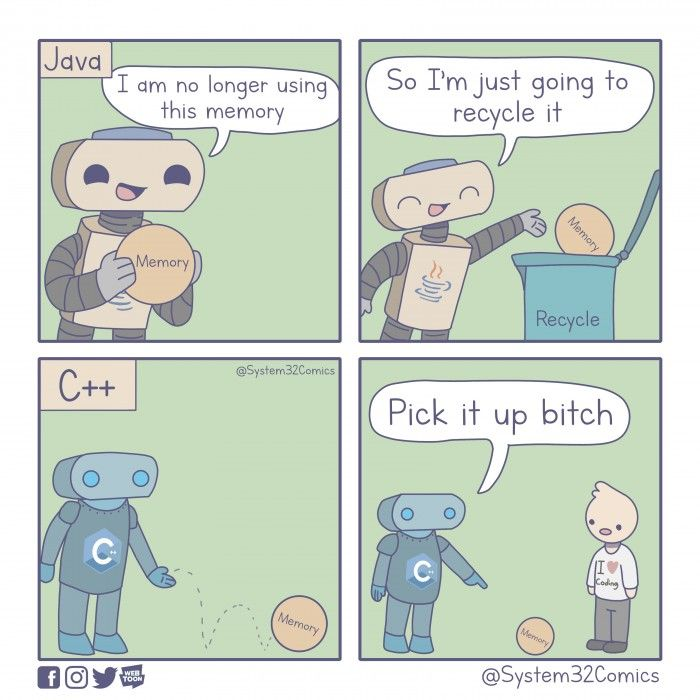

# 11 Java – Objekte

Nachdem ich euch jetzt gefühlt ein Dutzend Mal das Wort „Objekt“ um die Ohren gehauen habe, wird es höchste Zeit,
dass wir uns endlich diesem mysteriösen Thema widmen. Was sind eigentlich Objekte? Fast alles, was in Java existiert,
besteht aus Objekten, die auf sogenannten
<format color="%LinkColor%"><a href="02-java-data-types.md#reference-data-types-outlook">Referenzdatentypen</a></format>
 basieren – die
<format color="%LinkColor%"><a href="02-java-data-types.md#primitive-data-types">primitiven Datentypen</a></format> wie
<code>int</code> und <code>boolean</code> einmal ausgenommen.

Ein Objekt ist im Wesentlichen eine Instanz einer Klasse und diese Instanz kann so ziemlich alles sein, was ihr euch
vorstellen könnt – von Bällen, über Menschen, bis hin zu abstrakten Konzepten wie Aktivitäten oder Dimensionen.

Stellt euch vor, ihr seid im Spielzeugladen: Dort gibt es Bälle, Autos und vielleicht sogar eine mysteriöse Dimension
in eine andere Welt. All diese Spielzeuge, äh, Objekte, stammen aus einer Art Bauanleitung – der
<format color="%LinkColor%"><a href="10-java-classes.md">Klasse</a></format>. Jede dieser Klassen ist ein Nachfahre der
Klasse <format color="%LinkColor%"><a href="14-java-oop.md#the-mother-of-all-classes-object">Object</a></format> – der
Urmutter aller Klassen in Java. Aber keine Sorge. Die Details dazu werden wir in
<format color="%LinkColor%"><a href="14-java-oop.md#inheritance">Kapitel 14 – OOP: Vererbung</a></format> noch genau
unter die Lupe nehmen.

Also egal, ob ein Ball oder eine andere Dimension, in Java ist es immer ein Objekt. Ein Objekt ist nicht nur
irgendein zufälliger Datenhaufen, sondern ein Codebaustein der brav die
<format color="%LinkColor%"><a href="14-java-oop.md#principles-of-oop">Regeln der objektorientierten Programmierung</a>
</format> befolgt (in den meisten Fällen) und durch die Eigenschaften
(<format color="%LinkColor%"><a href="10-java-classes.md#object-variables">Objektvariablen</a></format>) und
Funktionalitäten (<format color="%LinkColor%"><a href="10-java-classes.md#object-methods">Objektmethoden</a></format>)
beschrieben wird.

Zwei spezielle Typen wurden bereits in früheren Kapiteln betrachtet.

<list>
  <li><format color="%LinkColor%"><a href="05-java-strings.md">Kapitel 5 – Zeichenketten</a></format></li>
  <li><format color="%LinkColor%"><a href="08-java-arrays.md">Kapitel 8 – Arrays</a></format></li>
</list>

Auch eigene Objekte bzw. <format color="%LinkColor%"><a href="02-java-data-types.md">Referenztypen</a></format>
 können erstellt werden, wie z. B. ein <code>Dog</code> oder <code>Movie</code>.

## Initialisierung {id="initialisation"}

In <format color="%LinkColor%"><a href="10-java-classes.md">Kapitel 10 – Klassen</a></format> wurde bereits eine
Klasse <code>Dog</code> erstellt.

<code-block lang="java">
    public class Dog {
    
        public String name;
        public int age;
    
        public Dog(String name, int age) {
            this.name = name;
            this.age = age;
        }
    
        public Dog(String name) {
            this(name, 0);
        }
    
        public void eat() {
            System.out.println(this.name + " is eating!");
        }
    
        public void bark() {
            System.out.println(this.name + " barks!");
        }
    }
</code-block>

Nun werden wir zu dieser Klasse zwei <code>Dog</code>-Objekte in der <code>Main</code>-Klasse anlegen.

<code-block lang="java">
    public class Main {
    
        public static void main(String[] args) {
            Dog bello = new Dog("Bello");
            Dog killer = new Dog("Killer", 5);
        }
    }
</code-block>

Die runden Klammern müssen genau die Anzahl der Werte enthalten, die die
<format color="%LinkColor%"><a href="10-java-classes.md#constructors">Konstruktoren</a></format> erwarten. Da wir einen
Konstruktor mit einem Wert und einen mit zwei Werten haben, sind beide Varianten gültig. Mit dem
<format color="%LinkColor%"><a href="01-java-token.md#keywords">Keyword</a></format> <code>new</code> wird ein neues
Objekt (Instanz) der <format color="%LinkColor%"><a href="10-java-classes.md">Klasse</a></format> erstellt und im
<tooltip term="Java-Heap"><format color="%GlossaryLinkColor%">Java-Heap</format></tooltip> allokiert.

## Objektvariablen auslesen und verändern {id="reading-and-changing-object-variables"}

Wollen wir nun die Werte der Objekte auf der Konsole ausgeben, können wir nicht einfach nur das Objekt an die
<code>println()</code>-Methode übergeben. Dadurch erhalten wir eine ziemlich merkwürdig aussehende Zeichenfolge, die
weiter unten im Abschnitt <format color="%LinkColor%"><a href="#the-tostring-method">"Die toString()-Methode"</a>
</format> erklärt wird.

<code-block lang="java">
    public static void main(String[] args) {
        Dog bello = new Dog("Bello");
        Dog killer = new Dog("Killer", 5);
    
        System.out.println(bello);  // kesares.techarchive.Dog@65ab7765
        System.out.println(killer); // kesares.techarchive.Dog@1b28cdfa
    }
</code-block>

Um auf die Variablen zugreifen zu können, sprechen wir einfach über das Objekt den Namen der
<format color="%LinkColor%"><a href="10-java-classes.md#object-variables">Objektvariablen</a></format> an.

<code-block lang="java">
    public static void main(String[] args) {
        Dog bello = new Dog("Bello");
        Dog killer = new Dog("Killer", 5);
    
        System.out.println(bello.name);  // Bello
        System.out.println(killer.name); // Killer
    }
</code-block>

Auf diese Weise können wir nicht nur die Werte abgreifen, sondern auch verändern.

<code-block lang="java">
    public static void main(String[] args) {
        Dog bello = new Dog("Bello");
        Dog killer = new Dog("Killer", 5);
    
        System.out.println(bello.name);  // Bello
        System.out.println(killer.name); // Killer
        System.out.println(bello.age);   // 0
        System.out.println(killer.age);  // 5
        
        bello.name = "Balu";
        killer.name = "Rocky";
        bello.age = 10;
        killer.age = 3;
        
        System.out.println(bello.name);  // Balu
        System.out.println(killer.name); // Rocky
        System.out.println(bello.age);   // 10
        System.out.println(killer.age);  // 3
    }
</code-block>

Die beiden Objekte haben jeweils eine Objektvariable für den Namen und eine für das Alter. Die
<format color="%LinkColor%"><a href="10-java-classes.md#object-variables">Objektvariablen</a></format> sind abhängig von
einem konkreten Objekt und somit auch dessen Werte. Werden die Werte eines Objekts verändert, hat dies keine
Auswirkungen auf die Werte eines anderen Objekts.

<note>
    
Bei <format color="%NoteLinkColor%"><a href="10-java-classes.md#class-variables">Klassenvariablen</a></format>
    sieht dies anders aus. Denn sie gehören zur Klasse und nicht zu einem Objekt.

</note>

## Zugriff auf Objektvariablen und Objektmethoden {id="access-to-object-variables-and-methods"}

Aber wollen wir wirklich zulassen, dass die Werte von Objekten beliebig von außen verändert werden können? Stellt
euch vor, es geht um euer Bankkonto mit einer Objektvariablen <code>balance</code>. Möchte wirklich jemand, dass einfach
von außen <code>yourBackAccount.balance = -1000</code> gesetzt werden kann? Wahrscheinlich nicht.

Dies ist natürlich ein sehr vereinfachtes Beispiel für ein jedoch reales Problem. In der Realität würden solche
Problemstellungen natürlich über Konzepte wie Authentifizierungen und Autorisierungen abgesichert werden. Zum Glück kann
nicht jeder so einfach mit ein paar Zeilen Code euer Konto plündern … zumindest nicht, wenn alles richtig umgesetzt
wurde. 👀

Um den unkontrollierten Zugriff zu verbieten, setzen wir in unserem Fall die
<format color="%LinkColor%"><a href="12-java-modifier-access-rights.md#access-modifier">Access Modifier</a></format> der
<format color="%LinkColor%"><a href="10-java-classes.md#object-variables">Objektvariablen</a></format> auf
<code>private</code>.

<code-block lang="java">
    private String name;
    private int age;
</code-block>

Jetzt können die Werte nicht mehr einfach so verändert werden, da sie nur noch innerhalb der Klasse
<code>Dog</code> sichtbar sind.

<code-block lang="java">
    public static void main(String[] args) {
        Dog bello = new Dog("Bello");
        Dog killer = new Dog("Killer", 5);
    
        System.out.println(bello.name);  // No access
        System.out.println(killer.name); // No access
        System.out.println(bello.age);   // No access
        System.out.println(killer.age);  // No access
    
        bello.name = "Balu";             // No access
        killer.name = "Rocky";           // No access
        bello.age = 10;                  // No access
        killer.age = 3;                  // No access
    
        System.out.println(bello.name);  // No access
        System.out.println(killer.name); // No access
        System.out.println(bello.age);   // No access
        System.out.println(killer.age);  // No access
    }
</code-block>

Nur haben wir jetzt auch auf die eigentlichen Werte keinen Zugriff mehr. Hier kommen die in
<format color="%LinkColor%"><a href="10-java-classes.md">Kapitel 10 – Klassen</a></format> angesprochenen
<format color="%LinkColor%"><a href="10-java-classes.md#getter-and-setter">get()-Methoden</a></format> zum Einsatz.

<code-block lang="java">
    public class Dog {

        // ...
    
        public String getName() {  
            return name;  
        }  
    
        public int getAge() {  
            return age;  
        }
    }
</code-block>

In der <code>main()</code>-Methode müssen wir jetzt nur noch diese
<format color="%LinkColor%"><a href="10-java-classes.md#object-methods">Objektmethoden</a></format> über das Objekt
aufrufen. Auch alle weiteren Objektmethoden können auf diese Weise aufgerufen werden.

<code-block lang="java">
    public static void main(String[] args) {
        Dog bello = new Dog("Bello");
        Dog killer = new Dog("Killer", 5);
    
        System.out.println(bello.getName());  // Bello
        System.out.println(killer.getName()); // Killer
        System.out.println(bello.getAge());   // 0
        System.out.println(killer.getAge());  // 5
    
        bello.name = "Balu";                  // No access
        killer.name = "Rocky";                // No access
        bello.age = 10;                       // No access
        killer.age = 3;                       // No access
    
        System.out.println(bello.name);       // No access
        System.out.println(killer.name);      // No access
        System.out.println(bello.age);        // No access
        System.out.println(killer.age);       // No access
    }
</code-block>

Für das Starten des Programms müssen jedoch die restlichen Zeilen mit den Errors entfernt oder auskommentiert werden.
Andernfalls wird auch auf der Konsole ein Error ausgegeben, dass die jeweiligen
<format color="%LinkColor%"><a href="10-java-classes.md#object-variables">Objektvariablen</a></format> nicht sichtbar
sind. Abhängig von der <tooltip term="IDE"><format color="%GlossaryLinkColor%">IDE</format></tooltip> kann sich dieser
jedoch unterscheiden.

<warning title="IntelliJ IDEA Error">
    <code-block>
        java: name has private access in kesares.techarchive.Dog
    </code-block>
</warning>

Sollte gewünscht sein, die Werte der Objekte zu ändern, können die dafür vorgesehenen
<format color="%LinkColor%"><a href="10-java-classes.md#getter-and-setter">set()-Methoden</a></format> verwendet werden.
Der Wert muss dann beim Aufruf mit übergeben werden.

<code-block lang="java">
    public void setName(String name) {
        this.name = name;
    }
</code-block>

Setter bieten zudem den Vorteil, dass wir ungültige Werte verweigern können. Das folgende Beispiel zeigt, dass der
übergebene Name nicht <code>null</code> sein darf. Um frühzeitig auf diesen Missstand aufmerksam zu machen, wird eine
<code>IllegalArgumentException</code> geworfen und das Programm bricht ab. Der Umgang mit Exceptions wird in
<format color="%LinkColor%"><a href="15-java-exceptions.md">Kapitel 15 – Exceptions</a></format>

<code-block lang="java">
    public void setName(String name) {
        if (name == null)
            throw new IllegalArgumentException("Name must not be null");
        this.name = name;
    }
</code-block>

<note title="Objektvariablenzugriff – Best Practice">
    
Die Objektvariablen sollten zu Beginn schon mit <code>private</code> versehen werden und
    <format color="%NoteLinkColor%"><a href="10-java-classes.md#getter-and-setter">Getter und Setter</a></format>
    sollten erst dann hinzukommen, wenn diese wirklich benötigt werden. Andernfalls könnte der Programmcode sehr früh
    mit unnötigen Zeilen Code gefüllt werden, die keine Verwendung haben.

</note>

## Die `toString()`-Methode {id="the-tostring-method"}

Die <code>toString()</code>-Methode ist eine
<format color="%LinkColor%"><a href="10-java-classes.md#object-methods">Objektmethode</a></format> der Klasse
<code>Object</code>. Da alle Objekte intern von dieser Klasse erben, ist es möglich, diese sowie viele andere
Objektmethoden zu überschreiben – siehe
<format color="%LinkColor%"><a href="14-java-oop.md#polymorphism">Kapitel 14 – OOP: Polymorphismus</a></format>.

<code-block lang="java">
    public String toString() {  
        return getClass().getName() + "@" + Integer.toHexString(hashCode());  
    }
</code-block>

Wird diese <format color="%LinkColor%"><a href="10-java-classes.md#object-methods">Objektmethode</a></format> von
einem Objekt aufgerufen, welche nicht die Objektmethode überschrieben hat, wird ein bestimmter
<format color="%LinkColor%"><a href="05-java-strings.md">String</a></format> zurückgegeben. Der <code>String</code>
 setzt sich aus dem Namen der aufrufenden <format color="%LinkColor%"><a href="10-java-classes.md">Klasse</a></format>,
einem <code>@</code>-Symbol und einer Adresse des Objekts – dem Hashcode in hexadezimaler Form mit 32 Bits kodiert – in
folgender Art zusammen:

<code-block>
    kesares.techarchive.Dog@65ab7765
</code-block>

Der Teil vor dem <code>@</code> repräsentiert den vollständigen Klassennamen der
<format color="%LinkColor%"><a href="10-java-classes.md">Klasse</a></format>, inklusive
<format color="%LinkColor%"><a href="16-java-packages-and-imports.md">Package</a></format>. Der Hashcode wird
typischerweise durch die Methode <code>hashCode()</code> berechnet, die standardmäßig für jedes Objekt eine eindeutige
Kennung zurückgibt.

## Der Garbage Collector {id="the-garbage-collector"}

In Programmiersprachen wie Java spielt der
<tooltip term="GC"><format color="%GlossaryLinkColor%">Garbage Collector</format></tooltip> (GC) eine zentrale Rolle bei
der Speicherverwaltung. Er sorgt dafür, dass nicht mehr benötigte Objekte aus dem Speicher entfernt werden, um Platz für
neue Objekte zu schaffen und den
<tooltip term="Java-Heap"><format color="%GlossaryLinkColor%">Heap-Speicher</format></tooltip> effizient zu nutzen.

In einer Welt ohne GC, wie C oder C++, müsstet ihr selbst darauf achten, wann welche Objekte nicht mehr gebraucht und
diese manuell aus dem Speicher entfernt werden. Klingt anstrengend, oder? In Java und in vielen anderen
Programmiersprachen übernimmt diese Aufgabe der Garbage Collector für euch.

#### Was ist der Heap-Speicher? {id="what-is-the-heap-memory"}

Der <tooltip term="Java-Heap"><format color="%GlossaryLinkColor%">Heap</format></tooltip> ist ein Bereich des
Arbeitsspeichers, der zur Laufzeit dynamisch Speicherplatz für Objekte bereitstellt. Immer wenn ein neues Objekt
erstellt wird, wird dafür Platz im Heap reserviert. Da der Speicher im Heap begrenzt ist, ist es wichtig, dass nicht
mehr benötigte Objekte freigegeben werden, um Speicherlecks zu vermeiden und die Leistung der Anwendung zu erhalten.

#### Wie funktioniert der Garbage Collector? {id="how-does-the-garbage-collector-work"}

Der <tooltip term="GC"><format color="%GlossaryLinkColor%">Garbage Collector</format></tooltip> verfolgt, welche
Objekte im <tooltip term="Java-Heap"><format color="%GlossaryLinkColor%">Heap</format></tooltip> noch genutzt werden und
welche nicht mehr erreichbar sind. Dies geschieht typischerweise durch Algorithmen wie Mark-and-Sweep oder Generational
Garbage Collection.

<list>
  <li><format color="%Highlight%">Mark-and-Sweep</format>: Der GC markiert alle Objekte, die noch von aktiven
    <format color="%LinkColor%">[Threads](26-java-multithreading.md)</format> oder anderen Objekten referenziert werden.
    Danach „fegt“ er den Heap, indem er alle nicht markierten Objekte entfernt und den freigewordenen Speicher
    zurückgibt.</li>
  <li><format color="%Highlight%">Generational Garbage Collection</format>: Diese Methode unterteilt den Heap in
    verschiedene Generationen (Young Generation, Old Generation, Permanent Generation). Objekte, die gerade erst
    erstellt wurden, landen in der Young Generation und werden dort häufiger überprüft. Objekte, die länger leben,
    werden in die Old Generation verschoben, wo sie seltener überprüft werden. Objekte, die während der gesamten
    Laufzeit des Programms existieren, werden in die Permanent Generation verschoben. Dies ist effizient, da viele
    Objekte nur kurzzeitig existieren und schnell wieder entfernt werden können.</li>
</list>

<note>
    
Wer sich genauer in das Thema <format color="%NoteHighlight%">Garbage Collection</format> in Java einlesen
    möchte, findet <format color="%NoteLinkColor%">
    <a href="https://www.oracle.com/webfolder/technetwork/tutorials/obe/java/gc01/index.html">hier</a></format> mehr
    Infos dazu.

</note>

#### Wie erkennt der Garbage Collector ungenutzte Objekte? {id="how-does-the-garbage-collector-detect-unused-objects?"}

Der GC identifiziert zerstörbare Objekte, indem er den Referenzgraphen der Objekte analysiert. Wenn ein Objekt keine
Referenzen mehr hat, also von keinem anderen Objekt oder aktiven
<format color="%LinkColor%"><a href="27-java-multithreading.md">Thread</a></format> mehr erreicht werden kann, wird es
als "garbage" (Müll) betrachtet und zur Entfernung freigegeben. Dies geschieht automatisch, ohne dass der Entwickle
sich aktiv um die Speicherfreigabe kümmern muss.

#### Speichermanagement in C/C++ {id="memory-management-in-c-and-cpp"}

In Sprachen wie C und C++ liegt die Speicherverwaltung vollständig in der Hand des Entwicklers. Hier gibt es keinen
automatischen Garbage Collector. Stattdessen muss der Entwickler den Speicher manuell verwalten – Speicher für Objekte
reservieren und ihn nach Gebrauch explizit wieder freigeben.

Diese manuelle Verwaltung ermöglicht eine sehr feinkörnige Kontrolle über den Speicher, was in einigen Szenarien, wie
bei der Systemprogrammierung oder Spielen, Vorteile in Bezug auf Leistung und Speicheroptimierung bieten kann.

Die manuelle Speicherverwaltung ist jedoch anfälliger für Fehler wie Speicherlecks oder Dangling Pointers (Referenzen
auf Speicher, der bereits freigegeben wurde). Solche Fehler können schwerwiegende Abstürze oder Sicherheitslücken
verursachen.

Im Vergleich dazu bietet ein
<tooltip term="GC"><format color="%GlossaryLinkColor%">Garbage Collector</format></tooltip> in Java oder ähnlichen
Sprachen den Vorteil, dass der Entwickler sich nicht um die Speicherfreigabe kümmern muss, wodurch das Risiko von
Speicherfehlern stark reduziert wird. Allerdings kommt dies oftmals mit einem kleinen Leistungseinbruch daher, da der
Speicherverbrauch regelmäßig analysiert und bereinigt werden muss.

{width="400"}

## Objektstruktur im Speicher {id="object-structure-in-memory"}

<format color="%ComingSoonColor%">Coming soon...</format>

## Komplexität von Referenzdatentypen {id="complexity-of-reference-data-types"}

Wie wir am Beispiel unserer <code>Dog</code>-Klasse gesehen haben, können
<format color="%LinkColor%"><a href="02-java-data-types.md#reference-data-types-outlook">Referenztypen</a></format> auch andere
Referenztypen als Eigenschaften besitzen. Der Umfang eines Objekts oder einer Klassenhierarchie kann dabei so flexibel
wie die Anforderungen der jeweiligen Anwendung sein – von schlicht und einfach bis hin zu regelrechten Code-Monstern.

Stellen wir uns beispielsweise ein <code>Motor</code>-Objekt vor. Dieses könnte durchaus ein weiteres Objekt, sagen
wir <code>Cylinder</code>, als Eigenschaft haben. Und weil sich Zylinder gerne in Gesellschaft von Schrauben befinden,
könnte dieses <code>Cylinder</code>-Objekt wiederum ein
<format color="%LinkColor%"><a href="08-java-arrays.md">Array</a></format> von <code>Screw</code>-Objekten beinhalten,
um alles schön zusammenzuhalten.

Um einmal ganz kurz das Thema der <format color="%LinkColor%"><a href="14-java-oop.md#inheritance">Vererbung</a>
</format> vorwegzunehmen, könnte es in einem anderen Szenario notwendig sein, eine Anwendung zu entwickeln, die
Lebewesen voneinander unterscheidet. Hier könnte man eine Klassenhierarchie aufbauen, in der <code>Animal</code> und
<code>Human</code> von einer übergeordneten Klasse <code>Creature</code> erben, während <code>Dog</code> von
<code>Animal</code> abstammt. In einer anderen, weniger komplexen Anwendung, die sich ausschließlich mit Menschen
befasst, könnte man es einfach bei einer `Human`-Klasse belassen, ohne tiefer in die Stammesgeschichte abzutauchen.

Kurz gesagt: Die Komplexität und Struktur der Klassen hängt ganz von den Bedürfnissen und Anforderungen eurer
Anwendung ab. Braucht ihr eine einfache Lösung, reichen vielleicht ein paar grundlegende Objekte. Wird es komplizierter,
könnt ihr eine detailliertere Klassenhierarchie aufbauen und eure
<format color="%LinkColor%"><a href="02-java-data-types.md#reference-data-types-outlook">Referenztypen</a></format> nach
Herzenslust schachteln. Es ist ein bisschen wie beim Kochen: Manchmal reicht ein Sandwich und manchmal wird es ein
Fünf-Gänge-Menü – es kommt ganz darauf an, was ihr auf den Tisch bringen wollt.

<note title="Tiefe Vererbungshierarchien">
    
Aber Vorsicht! So faszinierend es auch ist, Klassenhierarchien zu bauen, denkt daran, dass zu tiefe
    Vererbungshierarchien schnell ins Chaos führen können.

</note>

Wer bereits viel mit UI-Programmierung zu tun hat, weiß, dass dort sehr tiefe Vererbungshierarchien existieren (je
nachdem, welches Paradigma Anwendung findet) und schnell unübersichtlich werden können.
