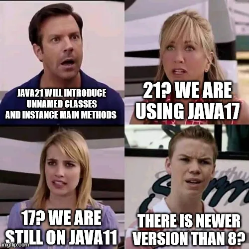

# 17 Java – Generics

## Was sind Generics? {id="what-are-generics"}

Generics wurden in Java 5 hinzugefügt, um
<format color="%LinkColor%"><a href="10-java-classes.md">Klassen</a></format>,
<format color="%LinkColor%"><a href="14-java-oop.md#interfaces">Interfaces</a></format> und
<format color="%LinkColor%"><a href="09-java-methods.md">Methoden</a></format> zu programmieren, die den Umgang mit
verschiedenen Datentypen, mittels Typ-Parametern, auf einer höheren generischen Abstraktionsebene ermöglichen.

Sie sorgen für Typsicherheit, da die Typüberprüfung bereits zur Kompilierungszeit erfolgt. Dadurch wird das Risiko
von <format color="%LinkColor%"><a href="15-java-exceptions.md#unchecked-exceptions">Laufzeitfehlern</a></format>
 reduziert. Auch die Notwendigkeit von
<format color="%LinkColor%"><a href="03-java-variables.md#type-casting">Type Castings</a></format> entfällt, da der Typ
einer Klasse oder Methode klar definiert ist.

## Generische Methoden {id="generic-methods"}

Nehmen wir an, wir haben verschiedene <format color="%LinkColor%"><a href="08-java-arrays.md">Arrays</a></format> mit
unterschiedlichen Typen und wir wollen alle Elemente jedes Arrays einfach nur auf der Konsole ausgeben. Dann würden wir
normalerweise Folgendes schreiben.

<code-block lang="java">
    public static void main(String[] args) {
        int[] arr1 = {1, 2, 3};
        String[] arr2 = {"A", "B", "C"};
        
        printArray(arr1);
        System.out.println();
        printArray(arr2);
    }
    
    public static void printArray(int[] array) {
        for (int i : array) {
            System.out.print(i + " ");
        }
    }
    
    public static void printArray(String[] array) {
        for (String s : array) {
            System.out.print(s + " ");
        }
    }
</code-block>

<code-block>
    1 2 3
    A B C
</code-block>

Da beide <format color="%LinkColor%"><a href="09-java-methods.md">Arrays</a></format> unterschiedliche Typen
verwalten, müssen wir auch zwei verschiedene
<format color="%LinkColor%"><a href="09-java-methods.md">Methoden</a></format> implementieren, die mit den
entsprechenden Typen umgehen können.

Bei genauerer Betrachtung könnte jedoch auffallen, dass wir in beiden <code>printArray()</code>-Methoden genau
dieselbe Logik implementiert haben. Wir haben also redundanten Code. Generics lösen dieses Problem.

<code-block lang="java">
    public static void main(String[] args) {
        Integer[] arr1 = {1, 2, 3}; // int -&gt; Integer
        String[] arr2 = {"A", "B", "C"};
    
        printArray(arr1);
        System.out.println();
        printArray(arr2);
    }
    
    public static &lt;T&gt; void printArray(T[] array) {
        for (T element : array) {
            System.out.print(element + " ");
        }
    }
</code-block>

Wir entfernen eine der <code>printArray()</code>-
<format color="%LinkColor%"><a href="09-java-methods.md">Methoden</a></format> und deklarieren die verbleibende Methode
als generische Methode mit Hilfe des Diamond-Operators <code>&lt;&gt;</code>, indem wir den generischen Typ
<code>T</code> vor den Rückgabetyp setzen. Der Parameter wird entsprechend zum Typparameter <code>T[]</code> angepasst.
Damit kann die Methode nun <format color="%LinkColor%"><a href="08-java-arrays.md">Arrays</a></format> beliebiger Typen
entgegennehmen. Die Logik der Methode bleibt unverändert und wir sparen uns doppelten Code.

Ein Punkt ist jedoch noch zu beachten. Bei der Verwendung der generischen Methode muss das <code>int</code>-Array
durch den entsprechenden Wrapper-Typ <code>Integer</code> ersetzt werden. Das liegt daran, da Generics nur mit
<format color="%LinkColor%"><a href="11-java-objects.md">Referenztypen</a></format> arbeiten können, nicht mit
<format color="%LinkColor%"><a href="02-java-data-types.md#primitive-data-types">primitiven Typen</a></format> wie
<code>int</code>.

Auch die Angabe von mehreren Typparametern durch Kommas getrennt ist möglich.

<code-block lang="java">
    public &lt;K, V&gt; void foo(K key, V value) {
        // ...
    }
</code-block>

<note>
    
Der generische Typ <code>&lt;T&gt;</code> ist ein Platzhalter und dient als eine Art
        <format color="%LinkColor%"><a href="01-java-token.md#identifier">Identifier</a></format>. Er kann prinzipiell
        beliebig benannt werden. Allerdings kann es leicht zu Verwirrung führen, wenn stattdessen Bezeichnungen wie
        <code>&lt;Element&gt;</code> oder <code>&lt;Item&gt;</code> verwendet werden. Solche ausführlicheren Namen könnten den
        Eindruck erwecken, es handle sich um konkrete
        <format color="%LinkColor%"><a href="10-java-classes.md">Klassen</a></format> bzw. um bestehende Typen.

    
Daher hat sich eingebürgert, generische Typen mit einzelnen Buchstaben zu benennen, um Missverständnisse zu
        vermeiden. Diese Praxis ist auch in der Standardbibliothek, wie den
        <format color="%LinkColor%"><a href="19-java-collections.md">Collections</a></format> zu finden. Besonders
        häufig begegnen euch dort die folgenden Konventionen.

    <list>
        <li><code>T</code> für Type (allgemeiner Typ)</li>
        <li><code>E</code> für Element (typischerweise in Listen, Sets etc.)</li>
        <li><code>K</code> für Key (bei Maps)</li>
        <li><code>V</code> für Value (unter anderem ebenfalls bei Maps)</li>
        <li><code>N</code> für Number (bei Zahlenoperationen)</li>
    </list>
</note>

## Beschränkte Typparameter {id="bounded-type-parameters"}

Es kann vorkommen, dass ihr die Arten von Typen einschränken möchtet, die an einen Typparameter übergeben werden
sollen. Wenn beispielsweise eine generische
<format color="%LinkColor%"><a href="09-java-methods.md">Methode</a></format> nur mit Zahlen arbeitet, soll diese
möglicherweise auch nur <format color="%LinkColor%"><a href="11-java-objects.md">Instanzen</a></format> der
<format color="%LinkColor%"><a href="10-java-classes.md">Klasse</a></format> <code>Number</code> oder deren
<format color="%LinkColor%"><a href="14-java-oop.md#inheritance">Unterklassen</a></format> akzeptieren. Dafür sind
Bounded Type Parameters (beschränkte Typparameter) gedacht.

<code-block lang="java">
    public static void main(String[] args) {
        System.out.println(max(10, 20));   // 20
        System.out.println(max(3.5, 4.1)); // 4.1
        System.out.println(max(-1, -5));   // -1
    }
    
    public static &lt;T extends Number&gt; T max(T x, T y) {
        if (x == null || y == null)
            throw new IllegalArgumentException("None of the arguments can be null");
        return x.doubleValue() &gt; y.doubleValue() ? x : y;
    }
</code-block>

Da wir in diesem Fall festlegen, dass <code>T</code> nur Instanzen der
<format color="%LinkColor%"><a href="10-java-classes.md">Klasse</a></format> <code>Number</code> annehmen darf,
können wir innerhalb der Methode auch auf die entsprechenden <code>doubleValue()</code>-Methoden zugreifen. Diese sind
in der <code>Number</code>-Klasse deklariert und werden in den Unterklassen, also den entsprechenden
<tooltip term="Wrapper-Class"><format color="%GlossaryLinkColor%">Wrapper-Klassen</format></tooltip> für numerische
Werte, überschrieben.

### Weiterführende Frage {id="btp-follow-up-question"}

Jetzt könnte man sich fragen, warum es in der <code>Math</code>-
<format color="%LinkColor%"><a href="10-java-classes.md">Klasse</a></format> für jede der numerischen
<format color="%LinkColor%"><a href="02-java-data-types.md#primitive-data-types">primitiven Typen</a></format> eine
eigene <format color="%LinkColor%"><a href="09-java-methods.md">Methode</a></format> <code>max()</code> gibt. Unsere
obige <code>max()</code>-Methode bietet doch eine viel kürzere Lösung.

Das stimmt. Dennoch gibt es gleich zwei Gründe, weshalb die spezialisierten <code>max()</code>-Methoden der
<code>Math</code>-Klasse weiterhin relevant sind.

<list>
  <li>
    
Zum einen existiert Java schon recht lange und die ursprünglichen Versionen von Java besaßen noch keine Generics.
    Da Java stets auf Rückwärtskompatibilität bedacht war, wurden mit der Einführung von Generics in Java 5 die APIs so
    angepasst, dass sie die neuen Sprachfunktionen unterstützen, ohne bestehenden Code zu beeinträchtigen.  
    Die <code>max()</code>- <format color="%LinkColor%"><a href="09-java-methods.md">Methoden</a></format> für
    <format color="%LinkColor%"><a href="02-java-data-types.md#primitive-data-types">primitive Datentypen</a></format>,
    so wie viele weitere Methoden, sind also Bestandteil des ursprünglichen Designs. Sie wurden beibehalten, um
    sicherzustellen, dass ältere Programme auch in neueren Laufzeitumgebungen korrekt funktionieren.
    

  </li>
</list>

Java 5 ist mittlerweile veraltet und man könnte annehmen, dass alle Software-Projekte auf modernere Java-Versionen
migriert sind, nicht wahr? Well ...

{width="400"}

Das Updaten von Code-Basen auf neuere Versionen ist tatsächlich ein allgemeines Problem und ja, viele Entwicklerteams
sitzen noch auf älteren Java-Versionen fest. Aber diese Problematik würde hier den Rahmen sprengen. Allerdings führt es
uns direkt zum zweiten Grund, wenn die vorherige Problematik wegfallen würde.

<list>
  <li>
    
In unserer generischen Implementierung der <code>max()</code>-
    <format color="%LinkColor%"><a href="09-java-methods.md">Methode</a></format> werden die Werte als Referenztypen
    behandelt, also als <format color="%LinkColor%"><a href="11-java-objects.md">Objekte</a></format>. Konkret handelt
    es sich um <code>T extends Number</code>, also Instanzen der
    <format color="%LinkColor%"><a href="10-java-classes.md">Klasse</a></format> <code>Number</code>. Um die Werte zu
    vergleichen, muss für jedes Objekt die Methode <code>doubleValue()</code> aufgerufen werden.  
    Und das wiederum führt zu einem Overhead, da Objekte zusätzlich Ressourcen benötigen. Im Gegensatz dazu arbeiten die
    spezialisierten <code>max()</code>-Methoden der <code>Math</code>-Klasse direkt mit
    <format color="%LinkColor%"><a href="02-java-data-types.md#primitive-data-types">primitiven Datentypen</a></format>
    wie <code>int</code> oder <code>double</code>. Dies erfordert weder
    <format color="%LinkColor%"><a href="03-java-variables.md#autoboxing">Autoboxing</a></format> noch
    <format color="%LinkColor%"><a href="03-java-variables.md#unboxing">Unboxing</a></format>, sodass die Werte ohne
    Umweg direkt verglichen werden können. Das spart Zeit und Ressourcen.

  </li>
</list>

### Multiple Typbeschränkung {id="multiple-type-bounds"}

Generics lassen sich nicht nur durch einen einzigen Typ beschränken. Wenn ein Typparameter bestimmte
<format color="%LinkColor%"><a href="10-java-classes.md#object-variables">Eigenschaften</a></format> oder
<format color="%LinkColor%"><a href="10-java-classes.md#object-methods">Objektmethoden</a></format> mehrerer
<format color="%LinkColor%"><a href="10-java-classes.md">Klassen</a></format> oder
<format color="%LinkColor%"><a href="14-java-oop.md#interfaces">Interfaces</a></format> erfüllen soll, ist es besonders
nützlich, mehrere Typbeschränkungen zu verwenden.

Dabei gilt: Ein Typparameter kann eine Klasse und beliebig viele Interfaces als
Begrenzung haben. Dabei muss jedoch die Reihenfolge eingehalten werden, sollte die Begrenzung sowohl von einer Klasse,
als auch von mehreren Interfaces abhängen → zuerst die Angabe der Klasse, dann die Angabe des oder der Interfaces.

<code-block lang="java">
    public interface Flyable {
        void fly();
    }

    public interface Swimmable {
        void swim();
    }

    public class Animal {
        // ...
    }

    public class Duck extends Animal implements Flyable, Swimmable {
        
        @Override
        public void fly() {
            System.out.println("Flying");
        }

        @Override
        public void swim() {
            System.out.println("Swimming");
        }
    }

    public class Zoo {

        public &lt;T extends Animal & Flyable & Swimmable&gt; void train(T animal) {
            animal.fly();
            animal.swim();
        }
    }
</code-block>

Die Methode <code>train()</code> stell hier sicher, dass das übergebene Objekt

<list>
  <li>
vom Typ <code>Animal</code> ist,
</li>
  <li>
das Interface <code>Flyable</code> implementiert und
</li>
  <li>
das Interface <code>Swimmable</code> implementiert.
</li>
</list>

## Generische Klassen {id="generic-classes"}

Es sind jedoch nicht nur <format color="%LinkColor%"><a href="#generic-methods">generische Methoden</a></format>
 möglich, sondern auch generische <format color="%LinkColor%"><a href="10-java-classes.md">Klassen</a></format> und
<format color="%LinkColor%"><a href="14-java-oop.md#interfaces">Interfaces</a></format>. Eine generische Klasse sieht genauso aus,
wie eine normale Klasse. Allerdings befindet sich hinter dem Klassennamen noch ein Typparameterabschnitt. Wie bei
generischen Methoden kann der Typparameterabschnitt einer generischen Klasse einen oder mehrere durch Kommas getrennte
Typparameter enthalten.

<code-block lang="java">
  public class Box&lt;T&gt; {
  
      private T value;
      
      public Box() {
          this.value = null;
      }
      
      public T getValue() {
          return this.value;
      }
      
      public void setValue(T value) {
          this.value = value;
      }
  
      public boolean isEmpty() {
          return this.value == null;
      }
  }
  
  public class Main {
      
      public static void main(String[] args) {
          Box&lt;Integer&gt; b1 = new Box&lt;&gt;();
          Box&lt;String&gt; b2 = new Box&lt;&gt;();
  
          b1.setValue(42);
          b2.setValue("Hello World!");
  
          System.out.println("Box 1 Content: " + b1.getValue());
          System.out.println("Box 2 Content: " + b2.getValue());
      }
  }
</code-block>

Solche Klassen werden als parametrisierte Klassen oder parametrisierte Typen bezeichnet, da sie einen oder mehrere
Parameter akzeptieren. Auch hier können die Klassen mit
<format color="%LinkColor%"><a href="#bounded-type-parameters">beschränkten Typparametern</a></format> versehen werden.
Dazu ein sehr einfaches Beispiel aus einem kleinen Projekt von mir.

<code-block lang="java">
    public class Focus&lt;T extends Entity&gt; {

    private T value;

    public Focus() {
        this.value = null;
    }
    
    public T getEntity() {
        return value;
    }

    public void setFocusOn(T value) {
        this.value = value;
    }

    public void setFreeMode() {
        this.value = null;
    }

    public boolean isFreeMode() {
        return this.value == null;
    }
}
</code-block>

Die parametrisierte Klasse <code>Focus&lt;T extends Entity&gt;</code> nutze ich im Rahmen eines Kamerasystems
innerhalb eines Spiels. Dadurch kann ich einer
<format color="%LinkColor%"><a href="10-java-classes.md">Klasse</a></format> <code>Camera</code> mitteilen, auf welchem
<code>Entity</code> sie den Fokus behalten soll. Standardmäßig liegt dort der Fokus auf der <code>Player</code>-Klasse,
welche wiederum von <code>Entity</code> erbt, sodass die Kamera dem Spieler folgt.

### Weiterführende Frage {id="gc-follow-up-question"}

Einige Fortgeschrittenere unter euch könnten sich jetzt vielleicht fragen, warum ich nicht einfach die
<format color="%LinkColor%"><a href="10-java-classes.md">Klasse</a></format> <code>Optional&lt;T&gt;</code> verwende.
Diese bringt tatsächlich genau die Funktionalität mit, die ich bräuchte.

Wieso ich für diesen Zweck eine eigene Klasse geschrieben habe, hat mehrere Gründe.
 

<list>
  <li>
    
Einer davon ist die Tatsache, dass <code>Optional&lt;T&gt;</code> primär als Rückgabetyp bei
    <format color="%LinkColor%"><a href="09-java-methods.md">Methoden</a></format> gedacht ist, um die Absenz eines
    fehlenden Wertes auszudrücken. <code>Focus&lt;T extends Entity&gt;</code> verwende ich jedoch als
    <format color="%LinkColor%"><a href="10-java-classes.md#object-variables">Objektvariablen</a></format> bzw. Attribut
    innerhalb der <format color="%LinkColor%"><a href="10-java-classes.md">Klasse</a></format> <code>Camera</code>.
      
    Um darauf hinzuweisen, dass <code>Optional&lt;T&gt;</code> nicht für die Modellierung von Objektzuständen gedacht
    ist, gibt IntelliJ tatsächlich eine Warnung aus, sollte die Klasse entgegen der Konvention als Attribut verwendet
    werden.
    

    <warning>
      <code>Optional&lt;Entity&gt; used as type for field 'entityWithFocus'</code>
    </warning>
  </li>
  <li>
    
Außerdem wollte ich den Fokus der Kamera nur für
    <format color="%LinkColor%"><a href="11-java-objects.md">Objekte</a></format> der
    <format color="%LinkColor%"><a href="10-java-classes.md">Klasse</a></format> <code>Entity</code> und deren
    <format color="%LinkColor%"><a href="14-java-oop.md#inheritance">Unterklasse</a></format> zulassen.
    <code>Optional&lt;T&gt;</code> lässt hingegen jede Art von Typ zu, da diese keinen
    <format color="%LinkColor%"><a href="#bounded-type-parameters">beschränkten Typparameter</a></format> besitzt.

  </li>
  <li>
    
Schlussendlich lässt sich aus meiner <format color="%LinkColor%"><a href="10-java-classes.md">Klasse</a></format>
    noch ableiten, dass ich einen "Freien Modus" implementieren wollte. Es sollte die Möglichkeit geben die Kamera
    flexibel zu steuern, ohne an eine bestimmte Entität gebunden zu sein.

  </li>
</list>

## Wildcards {id="wildcards"}

Es kann vorkommen, dass wir an manchen Stellen im Code mit
<format color="%LinkColor%"><a href="11-java-objects.md">Objekten</a></format> arbeiten, dessen Typ wir jedoch nicht
genau kennen. Zu diesem Zweck wurden Wildcards implementiert, die eine flexiblere Architektur ermöglichen. Eine Wildcard
wird mittels Fragezeichen <code>?</code> dargestellt und steht für einen unbekannten generischen Typ. Sie
erlauben es, generische Typen flexibler zu handhaben, indem sie eine gewisse Variabilität bei Typangaben zulassen, ohne
dass der genaue Typ festgelegt werden muss.

Wildcards lassen sich dabei in drei Arten unterteilen.

<list>
  <li><format color="%c1%"><a href="17-java-generics.md#unbounded-wildcards">Unbounded Wildcards</a></format></li>
  <li><format color="%c2%"><a href="17-java-generics.md#upper-bound-wildcards">Upper Bound Wildcards</a></format></li>
  <li><format color="%c3%"><a href="17-java-generics.md#lower-bound-wildcards">Lower Bound Wildcards</a></format></li>
</list>

### <format color="%c1%">Unbounded Wildcards</format> {id="unbounded-wildcards"}

<format color="%c1%">Unbounded Wildcards</format> <code>?</code> stehen für einen beliebigen Typ, ohne Einschränkung.
Wenn der genaue Typ nicht wichtig ist, sondern es sich nur um irgendeinen generischen Typ handeln muss, dann wird diese
Art verwendet.

Ein Beispiel wäre eine <format color="%LinkColor%"><a href="11-java-objects.md">Methode</a></format>, welche eine
<format color="%LinkColor%"><a href="19-java-collections.md#lists">Liste</a></format> von beliebigen
<format color="%LinkColor%"><a href="11-java-objects.md">Objekten</a></format> akzeptiert, ohne auf deren Typ
zuzugreifen.

<code-block lang="java">
public void printList(List&lt;?&gt; list) {
    for (Object object : list) {
        System.out.println(object);
    }
}
</code-block>

Die Methode <code>printList()</code> akzeptiert eine Liste beliebigen Typs, ohne die Elemente der Liste zu verändern
oder spezifisch zu behandeln.

### <format color="%c2%">Upper Bound Wildcards</format> {id="upper-bound-wildcards"}

<format color="%c2%">Upper Bound Wildcards</format> werden mit <code>? extends T</code> definiert, wobei
<code>T</code> die Obergrenze repräsentiert. Das bedeutet, dass die Wildcard einen Typ repräsentiert, welcher
<code>T</code> selbst oder eine Unterklasse von <code>T</code> darstellt. Schauen wir uns dazu das vorherige Beispiel
an und modifizieren es etwas.

<code-block lang="java">
public void printList(List&lt;? extends Number&gt; numbers) {
    for (Number number : numbers) {
        System.out.println(number.doubleValue());
    }
}
</code-block>

In diesem Beispiel kann die Methode
<format color="%LinkColor%"><a href="19-java-collections.md#lists">Listen</a></format> vom Typ <code>Number</code> oder
beliebigen Unterklassen (z. B. <code>Integer</code>, <code>Byte</code>, <code>Float</code> etc.) entgegennehmen. Das
macht dann Sinn, wenn Elemente nur gelesen, aber nicht sicher hinzugefügt werden können.

### <format color="%c3%">Lower Bound Wildcards</format> {id="lower-bound-wildcards"}

<format color="%c3%">Lower Bound Wildcards</format> werden mit <code>? super T</code> definiert und legen für den Typ
eine Untergrenze fest. Die Wildcard repräsentiert also einen Typ, der <code>T</code> selbst oder eine Oberklasse von
<code>T</code> darstellt. Sollen Elemente einer Datenstruktur hinzugefügt werden, ist es sinnvoll, diese Art zu
verwenden, da sicher ist, dass die Struktur
<format color="%LinkColor%"><a href="11-java-objects.md">Objekte</a></format> vom Typ <code>T</code> oder einer
Oberklasse akzeptiert.

<code-block lang="java">
    public void addIntegers(List&lt;? super Integer&gt; list) {
        list.add(1);
        list.add(2);
    }
</code-block>

## Type Erasure – Typlöschung {id="type-erasure"}

Type Erasure beschreibt den Prozess, bei dem der
<tooltip term="Compiler"><format color="%GlossaryLinkColor%">Compiler</format></tooltip> Typinformationen generischer
Klassen und Methoden zur Laufzeit entfernt. Nach der Überprüfung der Typen und ihrer Verwendung ersetzt der Compiler
alle Typparameter durch deren obere Typschranken sowie durch entsprechende
<format color="%LinkColor%"><a href="03-java-variables.md#explicit-type-casting">explizite Cast-Operationen</a></format>
 im <tooltip term="Bytecode"><format color="%GlossaryLinkColor%">Bytecode</format></tooltip>

<compare first-title="Zur Kompilierungszeit" second-title="Zur Laufzeit">
    <code-block lang="java">
        public static &lt;T&gt; void printType(T[] array) {
            for (T element : array) {
                System.out.println(element);
            }
        }
    </code-block>
    <code-block lang="java">
        public static void printType(Object[] array) {
            for (Object element : array) {
                System.out.println(element);
            }
        }
    </code-block>
</compare>

## Die Klasse <code>Optional&lt;T&gt;</code> {id="the-class-optional"}

Weiter oben im Abschnitt
<format color="%LinkColor%"><a href="#gc-follow-up-question">"Generische Klassen: Weiterführende Frage"</a></format> bin
ich bereits ein wenig auf die <format color="%LinkColor%"><a href="10-java-classes.md">Klasse</a></format>
<code>Optional&lt;T&gt;</code> eingegangen.

Die Klasse <code>Optional&lt;T&gt;</code> wurde in Java 8 eingeführt und ist als moderne Alternative für die
Methodenrückgabe anstelle von <code>null</code> vorgesehen.

### Rückgabe <code>null</code> vs Rückgabe <code>Optional&lt;T&gt;</code>